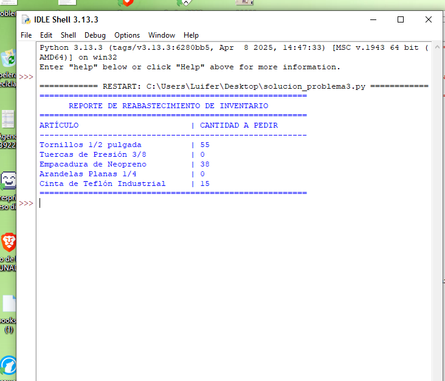

# Solución Problema 3 - Control de Inventario y Reabastecimiento
**Curso:** Fundamentos de Programación (Código 213022_3)  
**Universidad:** Universidad Nacional Abierta y a Distancia (UNAD)  
**Fase:** Fase 5 - Evaluación Final POA  

---
## 📌 Enunciado del Problema

Se dispone de una matriz que contiene información de inventario, con el siguiente formato:
[Código del artículo, Nombre del artículo, Stock actual, Stock mínimo requerido]
Se requiere desarrollar una herramienta que determine qué artículos necesitan ser reabastecidos.
Requisitos de desarrollo
* Matriz:
Crear una matriz con al menos 5 artículos.
*Módulos:
Implementar una función que determine la cantidad exacta a pedir para cada artículo.
* Lógica de negocio:
    * Si el stock actual es menor que el stock mínimo requerido, la cantidad a pedir será:
    * Stock mínimo requerido Stock actual
    * Si el stock actual es mayor o igual al stock mínimo, la cantidad a pedir será cero.
* Salida:
Mostrar una lista con el nombre de cada artículo y la cantidad exacta que debe ser solicitada.

## 📖 Código
```bash

def calcular_cantidad_a_pedir(stock_actual, stock_minimo):
    if stock_actual < stock_minimo:
        return stock_minimo - stock_actual
    else:
        return 0


def evaluar_inventario(matriz_inventario):
    reporte_pedidos = []
    
    for producto in matriz_inventario:
        codigo = producto[0]
        nombre = producto[1]
        stock_actual = producto[2]
        stock_minimo = producto[3]
        
        # Llamado a la función de lógica
        cantidad_a_pedir = calcular_cantidad_a_pedir(stock_actual, stock_minimo)
        
        # Guardamos el resultado en la lista final
        reporte_pedidos.append({
            "nombre": nombre,
            "cantidad": cantidad_a_pedir
        })
        
    return reporte_pedidos


def mostrar_resultados(reporte):
    print("=" * 55)
    print("      REPORTE DE REABASTECIMIENTO DE INVENTARIO")
    print("=" * 55)
    print(f"{'ARTÍCULO':<30} | {'CANTIDAD A PEDIR':<20}")
    print("-" * 55)
    
    for item in reporte:
        print(f"{item['nombre']:<30} | {item['cantidad']:<20}")
        
    print("=" * 55)


def main():
    # Matriz con al menos 5 artículos: [Código, Nombre, Stock Actual, Stock Mínimo]
    inventario = [
        ["ART001", "Tornillos 1/2 pulgada", 45, 100],
        ["ART002", "Tuercas de Presión 3/8", 150, 100],
        ["ART003", "Empacadura de Neopreno", 12, 50],
        ["ART004", "Arandelas Planas 1/4", 200, 150],
        ["ART005", "Cinta de Teflón Industrial", 5, 20]
    ]
    
    # Procesar la información
    reporte = evaluar_inventario(inventario)
    
    # Presentar la salida
    mostrar_resultados(reporte)


if __name__ == "__main__":
    main()
```
## 🚀 Ejecución del Código





